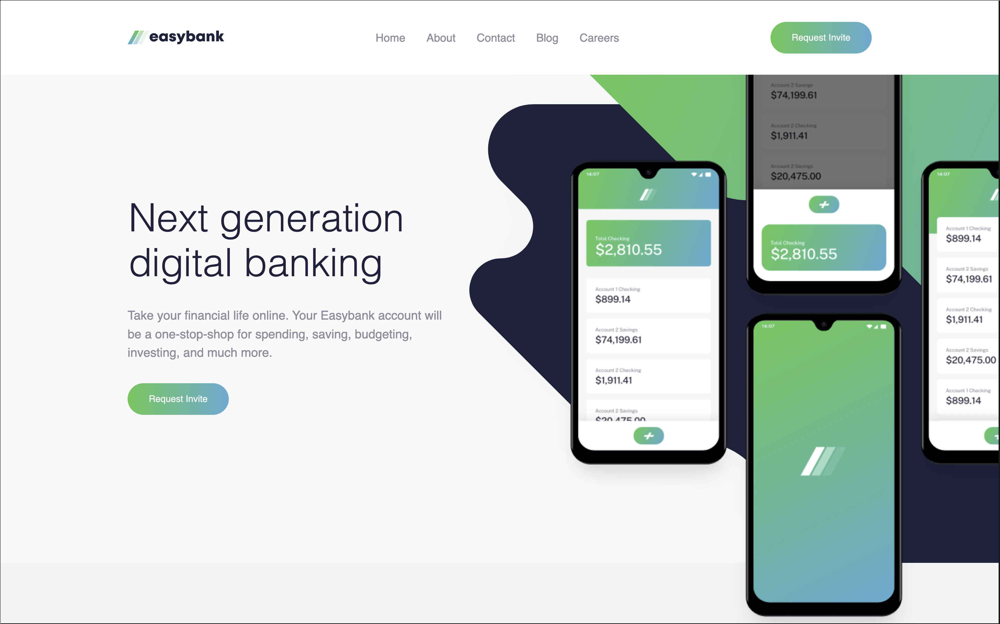
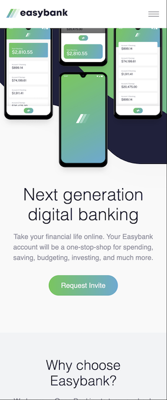
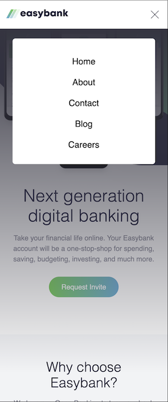

# Frontend Mentor - Easybank landing page solution

This is a solution to the [Easybank landing page challenge on Frontend Mentor](https://www.frontendmentor.io/challenges/easybank-landing-page-WaUhkoDN). Frontend Mentor challenges help you improve your coding skills by building realistic projects.

## Table of contents

- [Overview](#overview)
  - [The challenge](#the-challenge)
  - [Screenshot](#screenshot)
  - [Links](#links)
- [My process](#my-process)
  - [Built with](#built-with)
  - [What I learned](#what-i-learned)
  - [Continued development](#continued-development)
  - [Useful resources](#useful-resources)
- [Author](#author)

## Overview

### The challenge

Users should be able to:

- View the optimal layout for the site depending on their device's screen size
- See hover states for all interactive elements on the page

### Screenshot





### Links

- Solution URL: [GitHub Page](https://github.com/MCDoodle1/Easybank)
- Live Site URL: [Easybank Live Site](https://mcdoodle1.github.io/Easybank/)

## My process

I started by designing the HTML page and then styled the mobile version in CSS before the desktop version.

### Built with

- CSS custom properties
- Flexbox
- CSS Grid
- CSS Subgrid
- CSS Nesting
- Container Queries
- Mobile-first workflow

### What I learned

In this project I wanted to put CSS Subgrids and Container Queries to the test. I learned by studying Mozilla and reading blogs and by using them in this app.

Most difficult for me in this project was designing the mobile menu. I tried to design without JS but did not succeed because the checkbox input that triggers the checked/unchecked status either works in the header or in the main section, not in both.

````html
<header>
  <a href=""></a>
  <nav>
    <label for="menu-button" class="menu-icon menu-icon-open"></label>
  </nav>
  <nav>
    <ul>
      ```
    </ul>
  </nav>
  <button>Request Invite</button>
</header>
<main>
  <input type="checkbox" id="menu-button" />
  <div class="overlay"></div>
  <ul class="nav-mobile">
    ```
  </ul>
</main>
````

```css
header {
  display: flex;
  justify-content: space-between;
  align-items: center;
  padding: var(--space-m);
  background-color: var(--clr-neutral-white);
  position: relative;
  z-index: 1;
  & nav {
    & .menu-icon {
      display: inline-block;
      width: 2rem;
      height: 2rem;
      cursor: pointer;
    }
    & .menu-icon-open {
      background: url("./assets/images/icon-hamburger.svg") no-repeat top
        0.75rem right 0.2rem;
    }
    & .menu-icon-close {
      background: url("./assets/images/icon-close.svg") no-repeat top 0.5rem
        right 0.35rem;
    }
    &:last-of-type {
      display: none;
    }
  }
  & button {
    display: none;
  }
}

main {
  position: relative;
  container-type: inline-size;
  & input[type="checkbox"] {
    display: none;
  }
  & .overlay {
    position: absolute;
    top: 0;
    left: 0;
    width: 100%;
    height: 100%;
    background: linear-gradient(
      180deg,
      rgb(68, 68, 81) 0%,
      rgba(255, 255, 255, 0) 20%
    );
    opacity: 0;
    visibility: hidden;
    transition: opacity 0.3s ease;
    z-index: 10;
  }
  & input[type="checkbox"]:checked ~ .overlay {
    opacity: 1;
    visibility: visible;
  }
  & .nav-mobile {
    display: none;
    position: absolute;
    font-size: var(--fs-400);
    width: 85%;
    max-width: 30ch;
    background-color: var(--clr-neutral-white);
    padding-block-start: 1rem;
    padding-block-end: 2rem;
    top: 2ch;
    left: 50%;
    transform: translateX(-50%);
    text-align: center;
    border-radius: var(--br-s);
    z-index: 20;
  }
  & input[type="checkbox"]:checked ~ .nav-mobile {
    display: flex;
    flex-direction: column;
  }
```

### Continued development

Extend my knowledge of Subgrid, Container Queries and Nesting, and learn more about new CSS features.

### Useful resources

- [CSS Tricks](https://css-tricks.com)
- [MDN Web Docs](https://developer.mozilla.org/en-US/)
- [ChatGPT](https://chatgpt.com)
- [Stack Overflow](https://stackoverflow.com)

## Author

- Website - [Marco Clarijs](https://github.com/MCDoodle1)
- Frontend Mentor - [@MCDoodle1](https://www.frontendmentor.io/profile/MCDoodle1)
